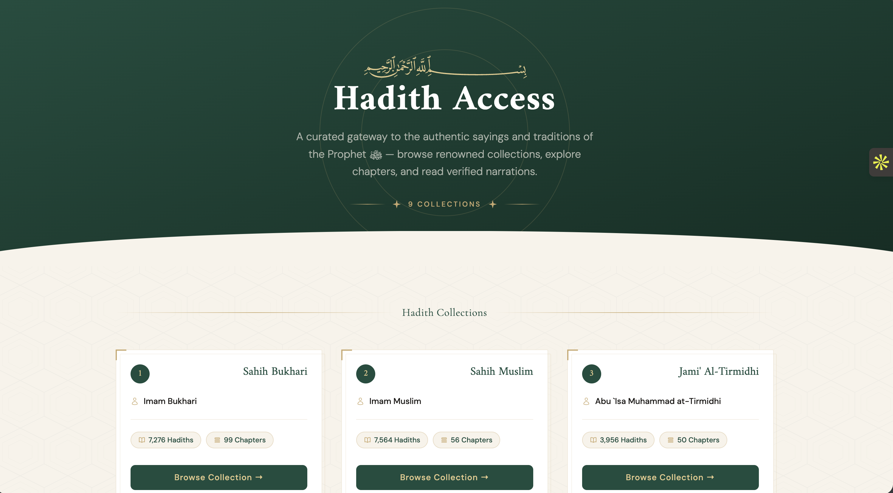

# Hadith Access



Hadith Access is a lightweight PHP web app for browsing hadith collections, chapters, and narrations through the Hadith API. It provides a simple reading experience with collection cards, chapter navigation, paginated hadith pages, and graceful handling when the upstream endpoint is temporarily unavailable.

## Features

- Browse major hadith collections from the home page.
- View chapters for each collection.
- Read chapter hadiths with Arabic text, English translation, narrator, reference, and grading.
- Paginated chapter reading.
- Copy individual hadith text and reference.
- Open Graph and Twitter card metadata for rich link previews.
- Fly.io-ready Docker deployment.
- Friendly temporary error page for chapter endpoint failures.

## Tech Stack

- PHP 8
- Composer
- Guzzle HTTP
- vlucas/phpdotenv
- Tailwind CDN
- Fly.io

## Project Structure

```text
.
├── books.php                 # Collection chapter listing page
├── chapter.php               # Hadith chapter reader with pagination
├── components/               # Shared head, header, footer, and page styles
│   ├── headtag.php
│   ├── header.php
│   └── hadithog.png          # README and social preview image
├── src/AppService/           # API service layer
│   └── AppService.php
├── Dockerfile                # Fly.io container build
├── fly.toml                  # Fly.io app configuration
├── composer.json
└── index.php                 # Home page
```

## Requirements

- PHP 8.1 or newer
- Composer
- A Hadith API key

## Environment Variables

Create a `.env` file in the project root:

```env
HADITH_API_KEY=your_api_key_here
```

The app reads this key from the environment in production, so set the same value as a Fly secret before deploying.

## Local Setup

Install dependencies:

```bash
composer install
```

Start the local PHP server:

```bash
php -S 127.0.0.1:8080 -t .
```

Open:

```text
http://127.0.0.1:8080
```

## Deployment To Fly.io

Set the API key as a Fly secret:

```bash
fly secrets set HADITH_API_KEY=your_api_key_here
```

Deploy:

```bash
fly deploy
```

The Dockerfile installs Composer dependencies during the image build and serves the app with PHP on port `8080`, matching the Fly configuration.

## Important Routes

```text
/index.php
/books.php?slug=sahih-bukhari
/chapter.php?slug=sahih-bukhari&chapter=1
/chapter.php?slug=sahih-bukhari&chapter=1&page=2
```

## Error Handling

Some chapter pages depend on upstream Hadith API availability. If the endpoint fails or times out, `chapter.php` returns a friendly temporary error page instead of exposing a PHP fatal error. Users can retry the chapter after a short while.

## Social Preview

The shared metadata lives in:

```text
components/headtag.php
```

The preview image used for Open Graph, Twitter cards, and this README is:

```text
components/hadithog.png
```

After deploying metadata changes, refresh cached previews with tools like the Facebook Sharing Debugger or Twitter/X Card Validator.

## License

No license has been specified yet.
